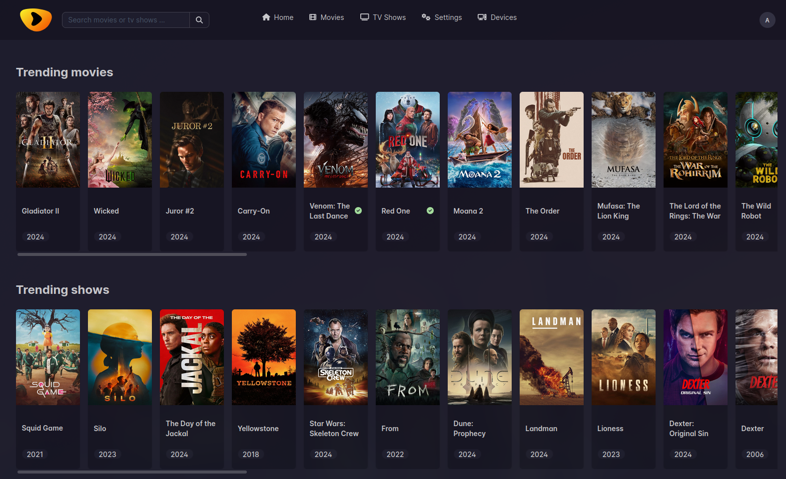
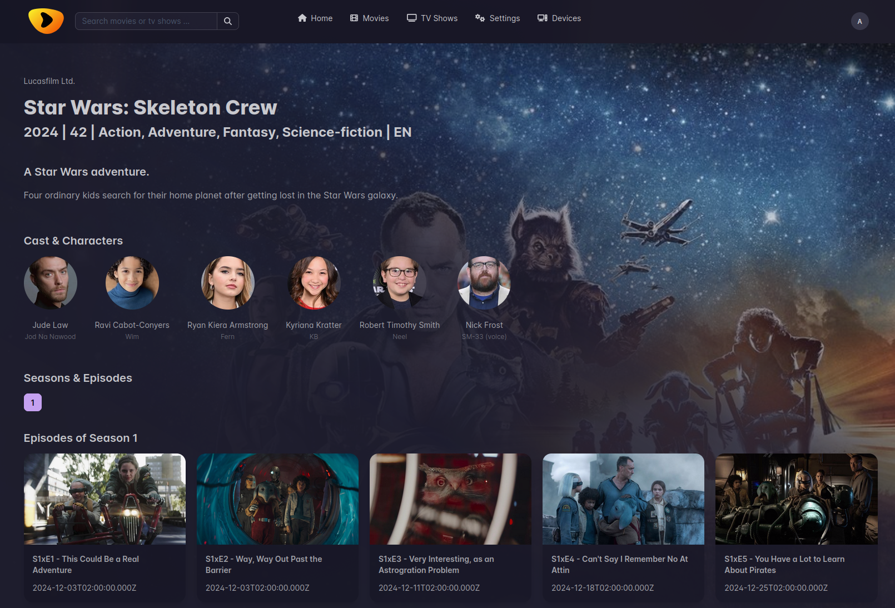
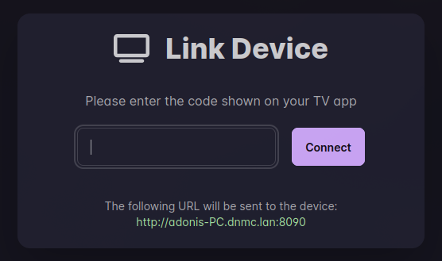

<h1 align="center">

</h1>

<h4 align="center">Enjoy movies and TV shows.</h4>

<h2 align="center">To be used with <a href="https://github.com/ad-on-is/odin-tv">Odin TV</a></h2>


[]()
[]()




# 🚀 Key features

- Discover movies and shows
- Scrobble
- See your watchlists
- Setup custom sections from Trakt lists
- Scrape Jackett for Torrents
- Multi-User support
- Unrestrict links with RealDebrid/AllDebrid

# 💡 Prerequisites

> [!WARNING]
>
> In order to make sure Odin works as expected, please setup these things before starting the app.

- Trakt API credentials
- TMDB API key
- A working Jackett server
  - Make sure you have some good indexers set up
- At least one of:
  - RealDebrid Account
  - AllDebrid API_KEY

## 🐋 Setup with Docker (docker-compose)

```yaml
services:
  odin:
    image: ghcr.io/ad-on-is/odin:latest
    container_name: odin
    restart: always
    ports:
      - 6060:6060
    environment:
      - LOG_LEVEL=info
      - JACKETT_URL=http://jackett:9117
      - JACKETT_KEY=xxxxx
      - TMDB_KEY=<tmdbkey>
      - TRAKT_CLIENTID=<trakt_clientid>
      - TRAKT_SECRET=<trakt_secret>
      - ADMIN_EMAIL=<user> #optional
      - ADMIN_PASSWORD=<password> #optional
      - ALLDEBRID_KEY=<alldebrid_key> # if you have an AllDebrid account
    volumes:
      - ./pb_data:/pb_data

  jackett:
    image: lscr.io/linuxserver/jackett:latest
    container_name: jackett
    environment:
      - TZ=Etc/UTC
      - AUTO_UPDATE=true
    volumes:
      - ./jackett:/config
    restart: always
  flaresolverr:
    container_name: flaresolverr
    image: ghcr.io/flaresolverr/flaresolverr:latest
    restart: always
    environment:
      - LOG_LEVEL=info

  # use a reverse proxy to serve the app
  # nginx:
  # caddy:
```

# 1️⃣ First steps

## Trakt

- Create a new App: <https://trakt.tv/oauth/applications/new>
- Note down the Trakt `clientId` and `clientSecret`

## TMDB

- Create a new account and get an API key: <https://www.themoviedb.org/settings/api>
- Note down the `apiKey`

## Prepare the server

- Log in as admin
  - **E-Mail:** <admin@odin.local>, **Password:** odinAdmin1
- Configure RealDebrid
- Create a new user

# Configuration

## RealDebrid

- Connect to RealDebrid by following the steps in the frontend

## AllDebrid

- Go to [Apikey manager](https://alldebrid.com/apikeys/)
- Create a new API key
- Use the key as environment variable

## Trakt

- Log in as a **User**
- Go to Profile
- In the Trakt section click on "Login" and follow the steps

### Trakt Lists

- Go to settings
- Add lists, with title and url in the desired section

> [!INFO]
>
> [Trakt API](https://trakt.docs.apiary.io/) for info about possible endpoints
>
> Example: /movies/trending

#### Placeholders

- `::(year|month|day)::` current year|month|day
- `::(year|month|day):-1:` current year|month|day +1 (or -1)
- `::monthdays::` days of the current month

Examples:
`/movies/popular?years=::year::,::year:-1:` -> `/movies/popular?years=2024,2023`

# 📺 Connecting to Odin TV

> [!NOTE]
> This only works with a regular user, not an admin account.

- Install the [Odin TV](https://github.com/ad-on-is/odin-tv) app on your Android TV box
- Open Odin TV on your Android TV box. A screen with a code should show up.
- Login as your user in the Odin frontend, and go to devices
- Click on **Link device**, enter the code shown on your TV and click **Connect**



> [!NOTE]
> This process uses ntfy.sh to propagate the public URL from the server to the App. The public URL only needs to be accessible within your network where the Android TV is running on.

# 💻 Running local dev environment

```bash
# install Bun
curl -fsSL https://bun.sh/install | bash

# lone the repo
git clone https://github.com/ad-on-is/odin-movieshow
cd odin-movieshow

# install dependencies
bun install

# copy .env.example to apps/backend/.env and apps/frontend/.env and fill in the blanks

# run dev
bun --bun run dev


```

# Donations


## License

MIT

---

> GitHub [@ad-on-is](https://github.com/ad-on-is) &nbsp;&middot;&nbsp;
> Built using [pocketbase](https://pocketbase.io/) and [Nuxt](https://nuxt.com/)
